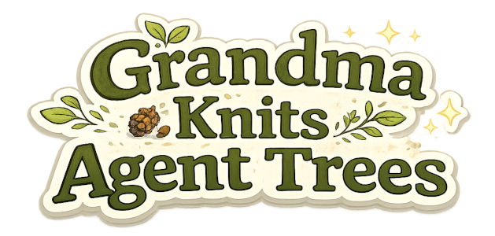

<p align="center">
  
  
</p>

<h1 align="center">Grandma KAT</h1>

<p align="center">
  <strong>Grandma Knits Agent Trees.</strong>
</p>

Yes, really. The name is absurd, and also just… accurate: you write a
*pattern*, hand it to grandma, and she knits it into a finished thing —
`grandma.knit(pattern)`. What comes off the needles is a tree of LLM steps:
prompts, tool calls, checks, and loops, all woven together with memory.

> **See it in action:** [`examples/`](examples/README.md) has a fully
> commented, runnable tree — a web-browsing agent that finds a business's
> street address — plus the imperative prototypes it was converted from.

## What is this, really?

Grandma KAT is a tiny, zero-dependency JavaScript library for building LLM
workflows as **explicit trees** instead of open-ended agent loops.

You define the control flow — which prompts run, in what order, what gets
retried, when to loop, when to stop — as plain data built with a chained
builder API. A runner (`grandma.knit()`) validates the whole tree up front
and then executes it, calling the model only for the parts that actually
need a model.

The guiding bet: **the control flow should be yours, and the LLM should only
do the fuzzy parts.** Modern small models (1–30B params, running locally)
are surprisingly good at narrow, well-scoped questions — "is there an
address on this page?", "which of these links looks promising?", "yes or
no?" — and surprisingly bad at sustaining an autonomous multi-step agent
loop. Grandma KAT is built around that reality: you write the procedure,
the model fills in the judgment calls, and every judgment call is checked,
bounded, and logged.

```js
import grandma, { Tree, goback, max } from 'grandma-kat';

const pattern = Tree.name('draft-and-verify')
  .prompt(m => `Write one paragraph about ${m.task}.`)
  .prompt(m =>
    `Does this paragraph stay on topic? Answer "pass" or "fail".\n\n${m.prev[0]}`)
  .until(m => m.prev[0]?.trim() === 'pass', max(3));

const { result, memory, runId } = await grandma.knit(pattern, {
  models: {
    default: { baseURL: 'http://localhost:8080/v1', apiKey: 'no-key', model: 'LFM2.5-1.2B' },
  },
  memory: { task: 'the history of knitting' },
});
```

## Where it fits (vs. LangChain & friends)

The LLM tooling landscape roughly splits into three camps:

| Tool | Mental model | Who decides what happens next |
|---|---|---|
| **LangChain / LangGraph** | Big framework: chains, retrievers, agents, graph state machines, an integration for everything | You wire the graph; within agent nodes, often the model |
| **CrewAI / AutoGen** | Multi-agent role-play: autonomous "agents" converse and delegate | Mostly the models |
| **Grandma KAT** | A recipe: a fixed tree of small steps with checks and bounded loops | You — always. The model only answers the questions you ask it |

More concretely:

- **Use LangChain/LangGraph** if you want a large ecosystem of integrations,
  RAG plumbing, and prebuilt agent abstractions — and you're comfortable
  with the abstraction layers and dependency weight that come with it.
- **Use CrewAI/AutoGen** if you want emergent behavior from agents talking
  to each other and have frontier-model budget to burn.
- **Use Grandma KAT** if you *already know the procedure* for your task and
  want an LLM (especially a small/local one) to execute the unreliable
  parts of it reliably: granular steps, explicit retries, visible
  validation, and a complete audit log — with zero dependencies and no
  framework lock-in. The tree *is* the control flow; you can read it, diff
  it, log it, and test it without a live model.

It's also designed so that **LLMs are good at writing the trees
themselves**: the builder API is small and patterned, and it fails loudly at
build time on hallucinated methods, missing branches, or unknown tool
names — the mistakes an LLM author actually makes.

And if your alternative is "just hand-roll a `while` loop around
`fetch()`": that's a fine instinct, and Grandma KAT is roughly that — plus
scoped memory, validation, bounded retries, per-step models and tools,
SQLite logging, and mock-model testing, for one import and no dependencies.

## Status

**Alpha** (v0.1.0). Implemented and tested: builder, markers, runner,
memory scope chain, single-round tool calls, gates, checks/goback/until,
`.memory()`/`.memoryUpdate()`, `.return()`, `.map()`, validation, SQLite +
console logging.

Deferred (designed, not built): tool-call pause mode, escalation promotion,
YAML authoring layer, mid-run resume, `grandma.compile()`.

## Requirements & install

- **Node.js ≥ 22.5** (uses the built-in `node:sqlite`; there are no npm
  dependencies)
- ES modules only

```sh
npm install grandma-kat
```

If the package isn't on npm yet in your timeline, depend on it directly:

```json
{ "dependencies": { "grandma-kat": "git+https://github.com/<you>/grandma-knits.git" } }
```

## Quick start

A tree that asks a small model to judge a yes/no question, and retries with
feedback until the model actually answers in the required format:

```js
import grandma, { Tree, goback, max } from 'grandma-kat';

const pattern = Tree.name('judge')
  .prompt(m => `Is ${m.topic} a good first programming language? Answer ONLY "yes" or "no".`)
  .check(
    m => ['yes', 'no'].includes(m.prev[0].trim().toLowerCase())
      || 'Answer with ONLY the word "yes" or "no".',
    goback(1, max(3)),
  );

const { result } = await grandma.knit(pattern, {
  models: {
    default: { baseURL: 'http://localhost:8080/v1', apiKey: 'no-key', model: 'my-local-model' },
  },
  memory: { topic: 'Python' },
  logLevel: 'info',
});

console.log(result); // "yes" (or "no" — grandma doesn't judge your language choices)
```

Run it against any OpenAI-compatible endpoint (llama.cpp, vLLM, Ollama, HF
router, OpenAI itself). Point `baseURL` at it, set `model`, done.

## Core concepts

### Trees are containers; prompts are always children

A named tree is a pure container with config. All *doing* lives in its
children, which run **sequentially, in declared order**. A container's
exported value is its last executed child's result.

```js
Tree.name('draft').prompt(m => `Write about ${m.task}`)

// draft        ← container (named tree)
//  └─ draft#1  ← anonymous prompt child (auto-named at build time)
```

Anonymous children get build-time names like `draft#1` (`#` is reserved in
your own names). If you reference a child's output, give it an explicit
name — `.prompt('outline', m => ...)` — positional auto-names shift when
you insert siblings.

**Doing methods accumulate; config methods select.** `.prompt(a).prompt(b)`
runs both. `.model('x').model('y')` resolves to `'y'` (last match wins).

### The children (leaves)

| Method | Kind | Produces |
|---|---|---|
| `.branch(tree)` | nested container | the subtree's exported value |
| `.prompt(fn)` | LLM call | the model's text |
| `.call(tool, argsFn)` | direct tool call, no LLM | the tool's result |
| `.check(fn, goback(n, max(k)))` | validation | nothing on pass; sets `m.error` on fail |
| `.memory(name, fn)` | memory write | the written value (also stored under `name`) |
| `.memoryUpdate(name, fn)` | memory update (slot must already exist) | the updated value |
| `.return(fn)` | early exit | stops the tree if `fn` returns non-null |
| `.map(name, arrayFn, tree)` | run a subtree per element | array of results, stored under `name` |

All of them accept an optional `when(cond)` gate as the first argument:

```js
.branch(when(m => m.branch.check_address === 'no'), tryFindTree)
```

### Memory: a scope chain

Every branch owns a memory linked to its parent's. **Reads resolve upward**
(nearest binding wins); **writes flow up one level** (a completed child's
result lands in its parent's slots under the child's name). Siblings can't
see each other's internals — only what completed branches exported.

Inside any prompt/gate/check function, the memory view `m` gives you:

| Access | Meaning |
|---|---|
| `m.branch.X` | exported **value** of branch/step `X`, resolved up the chain |
| `m.prev` | completed siblings' outputs, **most-recent-first** (positional) |
| `m.raw.branch.X` / `m.raw.prev[i]` | the full **record**: `{ content, reasoning, toolCalls, toolResults, calls }` |
| `m.error` | feedback from the last failed check (cleared on pass) |
| `m.item` | current element inside a `.map()` subtree |
| `m.<anything>` | any other name resolves up the scope chain (root inputs, ancestor slots) |

Root inputs come from `memory:` in the runtime. Sessions are just the root
scope threaded through runs: `knit()` returns `memory`; feed it back into
the next run.

### Flow control: `.check()` + `goback()` + `max()`

Validation is a visible node in the tree, and every backward jump is
**relative and bounded** — unbounded loops are unconstructible.

```js
.check(
  m => m.prev[0].length <= 5 || 'Too long. One word only.',
  goback(1, max(3, m => `Judge never answered validly: ${m.error}`)),
)
```

- Check returns `true` → pass, no output. Returns a string → fail; the
  string lands in `m.error` so the retried prompt can incorporate it
  (`${m.error ?? ''}`).
- `goback(1)` rewinds to the child just before the check; `m.prev` rewinds
  with it (named slots persist until overwritten).
- `max(3)` = 1 initial run + 3 retries, then a loud `KnitError`. The
  optional `errFn` controls the failure message.
- `.until(cond, max(k))` is the same primitive at container scope: re-run
  all children until `cond` passes. Omit `max()` and a documented default
  cap (3) applies.

### Models per step

`.model(name)` on any tree, inherited down: step → parent → root → runtime
default. Names reference the runtime's `models` map, so "different
endpoint" and "same endpoint, different model" are one concept:

```js
const pattern = Tree.name('agent')
  .model('cheap')                                              // default for this tree
  .branch(Tree.name('summarize').model('strong').prompt(...))  // override per branch
```

```js
await grandma.knit(pattern, {
  models: {
    cheap:  { baseURL: 'http://localhost:8080/v1', apiKey: 'no-key', model: 'LFM2.5-1.2B' },
    strong: { baseURL: 'http://localhost:8080/v1', apiKey: 'no-key', model: 'Qwen3-32B' },
  },
});
```

Model rules can also be **gated** — declare the default first and
conditional overrides later (config rules are last-match-wins). The
condition re-evaluates every time a prompt resolves its model, so the same
tree can switch models between loop passes as memory changes:

```js
Tree.name('agent')
  .model('cheap')                                                    // default first
  .model(when(m => m.branch.plan?.trim().toLowerCase() === 'hard'),  // gated override
    'strong')
  .branch(Tree.name('plan').prompt(m =>
    `Is this task "easy" or "hard" for a small model? One word: ${m.task}`))
  .branch(Tree.name('solve').prompt(m => `Solve: ${m.task}`))
// 'plan' runs on 'cheap' (the gate is false before plan exists — note
// the defensive `?.`); if plan says "hard", 'solve' runs on 'strong'
```

### Tools

Tools live in a **runtime-provided registry** — Grandma KAT stays decoupled
from MCP or any specific tool source:

```js
const tools = {
  navigate: {
    description: 'Open a URL in the browser tab.',
    parameters: { type: 'object', properties: { url: { type: 'string' } }, required: ['url'] },
    execute: async (args) => { /* ... */ },
  },
};
```

- `.tools('navigate', 'click')` on a container whitelists tools for its
  prompt children (inherited down the tree). Opt out per prompt:
  `.prompt(fn, { tools: [] })`. Default: no tools.
- When a prompt's model responds with tool calls, they execute **once** —
  no hidden internal loop. The text comes back as the value; calls and
  results are at `m.raw.prev[0].toolCalls` / `.toolResults`. Retries are
  your tree's job (`.check()` + `goback()`), visible and debuggable.
- `.call('navigate', m => ({ url: m.branch.best }))` calls a tool directly,
  no LLM involved.

### Validation up front

`knit()` sees the whole tree before the first LLM call and fails loudly:
unresolvable models, `.needs()` with no producer anywhere, unknown tool
names (all typos listed in one error), zero-children trees, `#` in names,
bare functions in condition slots ("did you mean `when()`?"). Soft
warnings cover duplicate child names, shadowed config rules, and
`.needs()` on auto-named slots.

`.needs('draft', 'navigate')` declares expected memory inputs: hard build
error if nothing in the tree (or injected memory) produces them, loud
runtime error if they don't resolve when the step runs.

### Reuse

`Tree.name(id)` registers into a global registry. Builder methods return
new definitions (copy-on-write), so a tree dropped into multiple parents
can never be mutated through one reference:

```js
const navigate = Tree.name('navigate').prompt(...);
const a = Tree.name('a').branch(navigate);
const b = Tree.name('b').branch(Tree.from('navigate'));
```

## Runtime options

```js
await grandma.knit(pattern, {
  models:   { /* name → { baseURL, apiKey, model } or { model, handler } */ },
  tools:    { /* name → { description, parameters, execute } */ },
  memory:   { /* initial root scope: plain JSON values */ },
  logger:   true,          // SQLite at ./logs/grandma-kat.db
            // 'path/to.db' | { path } | { log, close } | false (off, default)
  logLevel: 'none',        // 'none' (default) | 'info' | 'debug' (console)
});
// → { result, memory, runId }
```

Model entries are either an OpenAI-compatible endpoint
(`{ baseURL, apiKey, model }`) or a mock (`{ model, handler }`) — see
testing below. The endpoint flavor sends `temperature: 0` with a 120s
timeout, handles thinking-model `<think>` tag leakage, and can even rescue
tool calls that small models emit as plain text.

## Logging: where dead outputs live

Every event worth debugging is a row in SQLite — including flow control:
checks failing, gates skipping, gobacks rewinding, until-loop passes.

```sql
SELECT seq, branch_path, kind, content
FROM calls
WHERE run_id = '2026-07-27_10-00-00'
ORDER BY seq;
```

| Column | Contents |
|---|---|
| `run_id` | timestamp-based run identifier (also returned from `knit()`) |
| `definition_id` | root name + structural hash — which *version* ran |
| `seq` | global execution order |
| `branch_path` | path from root, e.g. `agent/draft#1` |
| `iteration` | loop pass number |
| `kind` | `llm_call` · `tool_call` · `tool_result` · `check` · `gate` · `flow` · `memory` · … |
| `content` | JSON — messages, response, tool args/results, check feedback, goback target |

Since rewound retries drop outputs from memory, **the log is where dead
outputs live.** `logLevel: 'info'` gives you a live console trace;
`'debug'` adds full prompts, reasoning, and gate evaluations.

## Testing without a live model

A model entry with a `handler` is a mock — script the responses, assert on
the tree's behavior. Tests exercise structure (gating, retries,
exhaustion), not the LLM's judgment:

```js
import { test } from 'node:test';
import assert from 'node:assert/strict';
import grandma from 'grandma-kat';

test('retries until the answer is valid', async () => {
  let calls = 0;
  const handler = async () => ({ content: ++calls === 1 ? 'maybe??' : 'yes' });

  const { result } = await grandma.knit(pattern, {
    models: { default: { model: 'mock', handler } },
    tools: {},
    logger: false,
  });

  assert.equal(result, 'yes');
  assert.equal(calls, 2); // failed the check once, retried with feedback
});
```

This repo's own suite runs this way: `npm test` (69 tests, no network).

## Examples in this repo

See the **[examples README](examples/README.md)** for the full tour and
setup instructions.

- **`examples/find-address/`** — the flagship: a tree that finds a business
  address on a website. Check the page, scan for clickables, ask the model
  which is promising, click, repeat — with tried-element tracking in memory,
  per-step tool whitelists, and bounded loops throughout. Heavily commented
  for newcomers.
- `examples/find-listings/`, `examples/find-pagination/` — the imperative
  prototypes (pre-tree style) that patterns like find-address are converted
  from, backed by the `browser-mcp` tool server.

## Not (yet) in the box

- Tool-call pause mode (pause the run around side-effecting tools)
- Escalation promotion (a failed retry escalating to a bigger rewind)
- YAML authoring layer
- Mid-run resume (runs are atomic; the log tells you how far a dead run got)
- `grandma.compile()` (hand a compiled subtree to another system as a tool)

## License

See [LICENSE.md](LICENSE.md).

---

## API reference (the deep end)

Everything below is exact behavior, as implemented. The short version:
**doing methods accumulate, config methods select (last match wins), gates
(`when()`) are accepted by all of them.**

### Builder semantics

- **Immutable builders.** Every method returns a *new* builder over a copied
  definition (copy-on-write). Sharing a tree across parents is bulletproof —
  extending one reference never mutates the others.
- **Two flavors of methods.**
  - *Accumulative (doing)* — every matching rule applies, in declared order:
    `.branch()`, `.prompt()`, `.call()`, `.check()`, `.memory()`,
    `.memoryUpdate()`, `.return()`, `.map()`.
  - *Selective (config)* — one value is chosen; the **last matching rule
    wins**: `.model()`, `.tools()`, `.until()`. Put defaults first, gated
    overrides later. An unconditional rule after conditional ones shadows
    them → build-time warning.
- **Gates.** Any method may take `when(cond)` as its first (or second)
  argument. Gates re-evaluate lazily whenever the child is reached —
  including on every loop pass. A gated-out child simply doesn't run: a skip
  is a non-write, occupying no `m.prev` position. A *bare function* in the
  condition slot throws at build time ("did you mean `when()`?").
- **Names.** Explicit names must be non-empty and may not contain `#`
  (reserved). Anonymous children are auto-named at `knit()` start:
  `${parentName}#${k}`, where `k` is the 1-based position among **all** of
  the parent's children. A gated-out child keeps its number; loop passes
  reuse the same slot. Referencing an auto-named slot in `.needs()` →
  build-time warning ("if you reference it, you name it").
- A named tree with **zero children** is a build error.

### `Tree` (static)

```js
import { Tree } from 'grandma-kat';
```

- **`Tree.name(id)`** — start a new tree and register it in the global
  registry under `id`. The registry is what makes reuse by name possible.
- **`Tree.from(id)`** — retrieve a registered tree (throws if unknown).
  Useful for dropping the same subtree into multiple parents.
- **`Tree.has(id)`** — `true` if `id` is registered.

### `.name(id)`

Names the tree. Every tree that becomes a `.branch()` or `.map()` child —
including the root you pass to `knit()` — must be named. The name is also
the memory key: a completed branch's exported value lands in its parent's
scope under this name, readable as `m.branch.<name>`.

### `.branch([when], tree)` — accumulative

Attaches a named subtree. On execution: the child runs in a fresh scope
linked to the current one (reads resolve upward; its internal writes stay
internal), and its **exported value** — its last executed child's result —
is written to the current scope under the child's name.

```js
.branch(Tree.name('draft').prompt(m => `Write about ${m.task}`))
.branch(when(m => m.branch.verify === 'fail'), reviseTree)
```

Throws at build time if the child tree is unnamed.

### `.prompt([when], [name], value, [options])` — accumulative

Appends an LLM prompt leaf. `value` is:

- a **string** (becomes one `user` message),
- a **message array** (`[{ role, content }, ...]` — each entry needs a
  `role`), or
- a **function** `(memory) => string | message[]`.

A leading string counts as a name only if a value follows it, so
`.prompt('just a static string')` is a value, and
`.prompt('outline', m => ...)` is a named prompt.

Execution: resolves the model (nearest `.model()` rule up the tree stack,
else the runtime default), resolves tools (per-prompt option, else
inherited `.tools()`, else none), makes **one** LLM call. If the model
returns tool calls, they execute **once**, sequentially — no internal
agent loop. The leaf's value is the response **text** (`''` if the model
only made tool calls); everything else is in the record:
`m.raw.prev[0].toolCalls` / `.toolResults` / `.reasoning` / `.calls`.
Retries are the tree's job (`.check()` + `goback()`).

Options: `{ tools: [...] }` — per-prompt tool whitelist, replacing the
inherited one (`{ tools: [] }` opts out of tools entirely). Unknown option
keys throw at build time.

### `.call([when], [name], tool, argsOrFn)` — accumulative

Appends a direct tool-call leaf — no LLM involved.

```js
.call('snapshot', () => ({}))                        // anonymous
.call('get_page', 'snapshot', () => ({}))            // named
.call(when(m => m.url), 'navigate', m => ({ url: m.url }))
```

`argsOrFn` is a plain value or `(memory) => args`. The tool is looked up in
the runtime registry; the leaf's value is the tool's raw return value (any
JSON). Unknown tool names throw — both at `knit()` start (whole-tree
validation) and at call time.

### `.check([when], fn, [flow])` — accumulative

Appends a validation leaf. `fn(memory)` returns:

- `true` → **pass**: no output (invisible in `m.prev`), and `m.error` is
  cleared.
- a **string** → **fail**: the string becomes `m.error` — feedback the
  retried prompt can interpolate (`${m.error ?? ''}`).
- `false` → **fail** with generic feedback (`'check failed'`).

`flow` must be `goback(n, max?)` (default: `goback(1)` with the default
cap). On failure, `goback(n)` rewinds to `n` children before the check (the
check itself isn't counted): `m.prev` entries produced by the jumped-over
children are dropped, named slots persist until overwritten, and execution
resumes at the jump point. Each backward jump spends one `max` budget;
exhaustion throws `KnitError` (the `max()` `errFn` message, or a framework
default naming the check, the count, and the last feedback). A `goback`
that would rewind past the first child throws at runtime.

### `.memory([when], name, fn)` — accumulative

Appends a memory-write leaf: pure state, no LLM or tool.

```js
.memory('tried', (m, cur) => [...(cur ?? []), m.prev[0]])
```

`fn(memory, currentValue)` returns the value to store under `name` **in the
current tree's scope** (`currentValue` is `undefined` on first write). The
written value also appears in `m.prev`, like a prompt's output — which
makes `.memory()` usable as the collecting final step of a `.map()`
subtree. Placement matters: a slot written inside a branch stays local to
that branch; put the `.memory()` at the level where the value needs to
live (e.g. at loop level to accumulate across `.until()` passes).

### `.memoryUpdate([when], name, fn)` — accumulative

Like `.memory()`, but the slot must **already exist** somewhere in the
scope chain. The update is written back into the scope that owns it — which
may be an ancestor, so this is how a nested branch updates loop-level
state. Throws `KnitError` at runtime if the slot doesn't exist (declare it
with `.memory()` first, or inject it via runtime `memory`). Also produces
`m.prev` output.

### `.return([when], fn)` — accumulative

Appends an early-exit leaf. `fn(memory)` is called; if it returns anything
other than `undefined`/`null`, the value is recorded (appearing in
`m.prev`), all remaining children are skipped, and the tree exports that
value. If it returns `undefined`/`null`, the return is a no-op occupying no
`m.prev` position. Anonymous (auto-named). Does **not** write a named slot —
use `.memory()` for that.

```js
.return(m => m.prev[0].includes('no candidates') ? 'no candidates' : undefined)
.return(when(m => m.branch.rated.length === 0), m => 'nothing to do')
```

### `.map([when], name, arrayFn, tree)` — accumulative

Appends a per-element iteration leaf. `arrayFn(memory)` returns an array;
the (named) subtree runs fully, once per element, **sequentially**, each
time in a fresh child scope with `m.item` set to the raw element. The
collected result values are stored as an array in the current scope under
`name` (also the leaf's own value). Empty (or non-array) input → no
invocations, `m.branch.<name>` is `[]`.

```js
.map('ratings', m => m.branch.candidates,
  Tree.name('rate')
    .prompt(m => `Rate "${m.item.text}": likely/unlikely`)
    .check(m => ['likely', 'unlikely'].includes(m.prev[0]) || 'One word.',
      goback(1, max(2))))
// m.branch.ratings = ['likely', 'unlikely', ...]
```

### `.model([when], name)` — selective (last match wins)

Adds a model rule. Resolution order for a prompt: the **innermost** tree on
the execution stack with a matching rule (last matching rule within that
tree wins), then the runtime default (the `default` entry in `models`, or
the only entry). Every referenced name is validated against the runtime
`models` map at `knit()` start — a typo there fails before any LLM call.

### `.tools([when], ...names)` — selective (last match wins)

Adds a tool-whitelist rule for prompt children (tool names from the runtime
registry; default is no tools). Inherited down the tree like `.model()`;
override per prompt with `.prompt(fn, { tools: [...] })`. All referenced
names are validated at `knit()` start: one error listing every unknown
name with its branch path. Note the sibling method `.call()` (direct tool
call) — one letter apart, deliberately different jobs.

### `.needs(...names)` — accumulative

Declares memory inputs the tree expects. The validation story for
LLM-authored trees:

- **Build time:** hard `KnitError` if a need is produced by no child
  anywhere in the tree **and** isn't in the injected runtime memory (i.e. a
  hallucinated producer). A need containing `#` warns (auto-named slot —
  give it an explicit name).
- **Run time:** when the tree starts, each need must resolve via the scope
  chain (ancestors may satisfy it) — loud `KnitError` on a miss.

Consequence: declare needs only for inputs present at **first execution**.
Loop-carried reads (draft reading `m.branch.verify` on pass 1) must stay
undeclared and defensive: `${m.branch.verify ?? ''}`.

### `.until([when], cond, [max])` — selective (last match wins)

Declares a container-level loop: after all children run, `cond(memory)` is
evaluated. Truthy → the tree exports and finishes. Falsy → **all** children
rewind (`m.prev` resets) and run again, spending one `max` budget per
rewind. Exhaustion throws `KnitError` (`errFn` message or framework
default). With no matching rule (e.g. its gate is false), no loop happens.
Edge counters reset when an outer loop re-runs the container.

```js
.until(m => !isNo(m.branch.check_address),
  max(3, m => `gave up after 3 iterations: ${m.error ?? 'not found'}`))
```

Conceptually sugar for an implicit `.check()` at the end of the container
with `goback(<all children>, max)` — same primitive, two scopes.

### Markers

```js
import { when, goback, max, DEFAULT_MAX } from 'grandma-kat';
```

- **`when(cond)`** — wraps a gate function `(memory) => boolean` for use as
  the first/second argument of any builder method. The wrapper is a
  distinct type, which is how the builder catches a bare function in the
  condition slot at build time.
- **`goback(n, max?)`** — the flow marker for `.check()`: rewind `n`
  children (positive integer). `n` counts children, not the check.
- **`max(count, errFn?)`** — bounds a backward edge: `count` = maximum
  backward jumps (positive integer; the initial run doesn't count, so
  `max(3)` = 1 run + 3 retries). `errFn(memory)` returns the exhaustion
  error message — `m.error` holds the last check feedback there. Omit
  `max()` entirely and `DEFAULT_MAX` (3) applies. There is no way to
  express an unbounded loop.
- **`KnitError`** — the error type thrown for build errors, validation
  failures, and budget exhaustion (`err.details` may carry context).

### `grandma.knit(pattern, runtime)`

Covered in [Runtime options](#runtime-options) above. To recap the
contract: validates the whole tree (names, children, needs, model and tool
references) **before the first LLM call**, executes children sequentially
in declared order, and resolves to
`{ result, memory, runId }` — where `result` is the root tree's last
executed child's value and `memory` is the root scope (JSON-serializable,
threadable into the next run).
