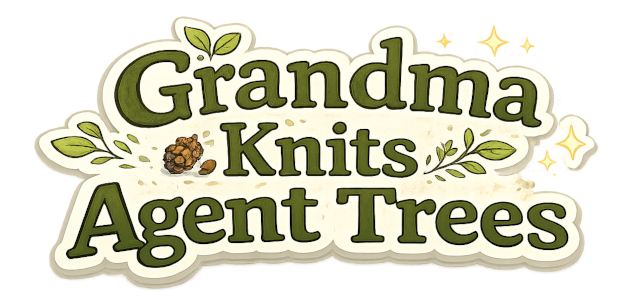

<p align="center">
  
  
</p>

<h1 align="center">Grandma KAT</h1>

<p align="center">
  <strong>Grandma Knits Agent Trees.</strong>
</p>

Yes, really. The name is absurd, and also just… accurate: you write a
*pattern*, hand it to grandma, and she knits it into a finished thing —
`grandma.knit(pattern)`. What comes off the needles is a tree of LLM steps:
prompts, tool calls, checks, and loops, all woven together with memory.

<sub>[inspired by immediac](https://immediac.com/)</sub>

> **See it in action:** [`examples/`](examples/README.md) has a fully
> commented, runnable tree — a web-browsing agent that finds a business's
> street address — plus the imperative prototypes it was converted from.

## What is this, really?

Grandma KAT is a tiny, zero-dependency JavaScript library for building LLM
workflows as **explicit trees** instead of open-ended agent loops.

You define the control flow — which prompts run, in what order, what gets
retried, when to loop, when to stop — as plain data built with one call:
`Tree(element, element, …)`. A runner (`grandma.knit()`) validates the whole
tree up front and then executes it, calling the model only for the parts
that actually need a model.

```js
import grandma, { Tree, Name, Prompt, Until, max } from 'grandma-kat';

const pattern = Tree(
  Name('draft-and-verify'),
  Prompt(m => `Write one paragraph about ${m.task}.`),
  Prompt(m => `Does this paragraph stay on topic? Answer "pass" or "fail".\n\n${m.prev[0]}`),
  Until(m => m.prev[0]?.trim() === 'pass', max(3)),
);

const { result, memory, runId } = await grandma.knit(pattern, {
  models: {
    default: { baseURL: 'http://localhost:8080/v1', apiKey: 'no-key', model: 'LFM2.5-1.2B' },
  },
  memory: { task: 'the history of knitting' },
});
```

The guiding bet: **the control flow should be yours, and the LLM should only
do the fuzzy parts.** Modern small models (1–30B params, running locally)
are surprisingly good at narrow, well-scoped questions — "is there an
address on this page?", "which of these links looks promising?", "yes or
no?" — and surprisingly bad at sustaining an autonomous multi-step agent
loop. Grandma KAT is built around that reality: you write the procedure,
the model fills in the judgment calls, and every judgment call is checked,
bounded, and logged.

## Where it fits (vs. LangChain & friends)

The LLM tooling landscape roughly splits into three camps:

| Tool | Mental model | Who decides what happens next |
|---|---|---|
| **LangChain / LangGraph** | Big framework: chains, retrievers, agents, graph state machines, an integration for everything | You wire the graph; within agent nodes, often the model |
| **CrewAI / AutoGen** | Multi-agent role-play: autonomous "agents" converse and delegate | Mostly the models |
| **Grandma KAT** | A recipe: a fixed tree of small steps with checks and bounded loops | You — always. The model only answers the questions you ask it |

More concretely:

- **Use LangChain/LangGraph** if you want a large ecosystem of integrations,
  RAG plumbing, and prebuilt agent abstractions — and you're comfortable
  with the abstraction layers and dependency weight that come with it.
- **Use CrewAI/AutoGen** if you want emergent behavior from agents talking
  to each other and have frontier-model budget to burn.
- **Use Grandma KAT** if you *already know the procedure* for your task and
  want an LLM (especially a small/local one) to execute the unreliable
  parts of it reliably: granular steps, explicit retries, visible
  validation, and a complete audit log — with zero dependencies and no
  framework lock-in. The tree *is* the control flow; you can read it, diff
  it, log it, and test it without a live model.

It's also designed so that **LLMs are good at writing the trees
themselves**: the `Tree(...)` surface is small and patterned, and it fails
loudly at build time on hallucinated elements, missing branches, or unknown
tool names — the mistakes an LLM author actually makes.

And if your alternative is "just hand-roll a `while` loop around
`fetch()`": that's a fine instinct, and Grandma KAT is roughly that — plus
scoped memory, validation, bounded retries, per-step models and tools,
SQLite logging, and mock-model testing, for one import and no dependencies.

## Status

**Alpha** (v0.1.0). Implemented and tested: the element surface
(`Tree(...)`), markers, runner, memory scope chain, the auto tool loop with
hooks, gates, checks/goback/until, `Memory` (plain and `update()` form),
`Return`, `Emit`, `Human` (pause/resume with DB-backed checkpoints), `Map`,
`Register`, validation, SQLite + console logging.

Deferred (designed, not built): tool-call pause mode, escalation promotion,
YAML authoring layer, `grandma.compile()`.

## Requirements & install

- **Node.js ≥ 22.5** (uses the built-in `node:sqlite`; there are no npm
  dependencies)
- ES modules only

```sh
npm install grandma-kat
```

If the package isn't on npm yet in your timeline, depend on it directly:

```json
{ "dependencies": { "grandma-kat": "git+https://github.com/<you>/grandma-kat.git" } }
```

## Quick start

A tree that asks a small model to judge a yes/no question, and retries with
feedback until the model actually answers in the required format:

```js
import grandma, { Tree, Name, Prompt, Check, goback, max } from 'grandma-kat';

const pattern = Tree(
  Name('judge'),
  Prompt(m => `Is ${m.topic} a good first programming language? Answer ONLY "yes" or "no".`),
  Check(
    m => ['yes', 'no'].includes(m.prev[0].trim().toLowerCase())
      || 'Answer with ONLY the word "yes" or "no".',
    goback(1, max(3)),
  ),
);

const { result } = await grandma.knit(pattern, {
  models: {
    default: { baseURL: 'http://localhost:8080/v1', apiKey: 'no-key', model: 'my-local-model' },
  },
  memory: { topic: 'Python' },
  logLevel: 'info',
});

console.log(result); // "yes" (or "no" — grandma doesn't judge your language choices)
```

Run it against any OpenAI-compatible endpoint (llama.cpp, vLLM, Ollama, HF
router, OpenAI itself). Point `baseURL` at it, set `model`, done.

## Core concepts

### Trees are containers; prompts are always children

A named tree is a pure container with config. All *doing* lives in its
children, which run **sequentially, in declared order**. A container's
exported value is its last executed child's result.

If a tree performs bookkeeping after producing its useful result, make the
result explicit with a `Return(...)` after that bookkeeping:

```js
const answer = Tree(
  Name('answer'),
  Prompt('response', m => `Answer: ${m.question}`),
  Memory('audit', m => ({ length: m.branch.response.length })),
  Return(m => m.branch.response),
);
```

Without the explicit return, the container exports the last bookkeeping value
instead. `Return(...)` is also the stable way for a parent to consume a named
child's intended result via `m.branch.<name>`.

```js
Tree(Name('draft'), Prompt(m => `Write about ${m.task}`))

// draft        ← container (named tree)
//  └─ draft#1  ← anonymous prompt child (auto-named at build time)
```

Anonymous children get build-time names like `draft#1` (`#` is reserved in
your own names). If you reference a child's output, give it an explicit
name — `Prompt('outline', m => ...)` — positional auto-names shift when
you insert siblings.

**Doing elements accumulate; config rules select.** Two `Prompt(...)`
elements both run. Two `Model(...)` rules resolve to the last match.

### The children (leaves)

| Element | Kind | Produces |
|---|---|---|
| `Branch(tree)` | nested container | the subtree's exported value |
| `Prompt(fn)` | LLM call | the model's text |
| `Call(tool, argsFn)` | direct tool call, no LLM | the tool's result |
| `Check(fn, goback(n, max(k)))` | validation | nothing on pass; sets `m.error` on fail |
| `Memory(name, fn)` | memory write | the written value (also stored under `name`) |
| `Memory(update(), name, fn)` | memory update (slot must already exist) | the updated value |
| `Return(fn)` | early exit | stops the tree if `fn` returns non-null |
| `Emit(fn)` | non-blocking output | calls `runtime.onEmit(value)`, continues |
| `Human(name, contextFn?)` | human-in-the-loop | pauses execution, waits for input |
| `Map(name, arrayFn, tree)` | run a subtree per element | array of results, stored under `name` |

Any element may take a `when(cond)` gate, anywhere among its arguments:

```js
Branch(when(m => m.branch.check_address === 'no'), tryFindTree)
```

### Memory: a scope chain

Every branch owns a memory linked to its parent's. **Reads resolve upward**
(nearest binding wins); **writes flow up one level** (a completed child's
result lands in its parent's slots under the child's name). Siblings can't
see each other's internals — only what completed branches exported.

Inside any prompt/gate/check function, the memory view `m` gives you:

| Access | Meaning |
|---|---|
| `m.branch.X` | exported **value** of branch/step `X`, resolved up the chain |
| `m.prev` | completed siblings' outputs, **most-recent-first** (positional) |
| `m.raw.branch.X` / `m.raw.prev[i]` | the full **record**: `{ content, reasoning, toolCalls, toolResults, calls }` (container records may also include `children`) |
| `m.error` | feedback from the last failed check (cleared on pass) |
| `m.item` | current element inside a `Map(...)` subtree |
| `m.<anything>` | any other name resolves up the scope chain (root inputs, ancestor slots) |

Root inputs come from `memory:` in the runtime. Sessions are just the root
scope threaded through runs: `knit()` returns `memory`; feed it back into
the next run.

### Flow control: `Check(...)` + `goback()` + `max()`

Validation is a visible node in the tree, and every backward jump is
**relative and bounded** — unbounded loops are unconstructible.

```js
Check(
  m => m.prev[0].length <= 5 || 'Too long. One word only.',
  goback(1, max(3, m => `Judge never answered validly: ${m.error}`)),
)
```

- Check returns `true` → pass, no output. Returns a string → fail; the
  string lands in `m.error` so the retried prompt can incorporate it
  (`${m.error ?? ''}`).
- `goback(1)` rewinds to the child just before the check; `m.prev` rewinds
  with it (named slots persist until overwritten).
- `max(3)` = 1 initial run + 3 retries, then a loud `KnitError`. The
  optional `errFn` controls the failure message.
- `Until(cond, max(k))` is the same primitive at container scope: re-run
  all children until `cond` passes. Omit `max()` and a documented default
  cap (3) applies.

### Models per step

`Model(name)` anywhere in a tree applies from that point on and is
inherited down: step → parent → root → runtime default. Names reference the
runtime's `models` map, so "different endpoint" and "same endpoint,
different model" are one concept:

```js
const pattern = Tree(
  Name('agent'),
  Model('cheap'),                                                   // default for this tree
  Branch(Tree(Name('summarize'), Model('strong'), Prompt(...))),    // override per branch
);
```

```js
await grandma.knit(pattern, {
  models: {
    cheap:  { baseURL: 'http://localhost:8080/v1', apiKey: 'no-key', model: 'LFM2.5-1.2B' },
    strong: { baseURL: 'http://localhost:8080/v1', apiKey: 'no-key', model: 'Qwen3-32B' },
  },
});
```

Model rules can also be **gated** — declare the default first and
conditional overrides later (rules are last-match-wins). The condition
re-evaluates every time a prompt resolves its model, so the same tree can
switch models between loop passes as memory changes:

```js
Tree(
  Name('agent'),
  Model('cheap'),                                                   // default first
  Model(when(m => m.branch.plan?.trim().toLowerCase() === 'hard'),  // gated override
    'strong'),
  Branch(Tree(Name('plan'), Prompt(m =>
    `Is this task "easy" or "hard" for a small model? One word: ${m.task}`))),
  Branch(Tree(Name('solve'), Prompt(m => `Solve: ${m.task}`))),
)
// 'plan' runs on 'cheap' (the gate is false before plan exists — note
// the defensive `?.`); if plan says "hard", 'solve' runs on 'strong'
```

### Tools

Tools live in a **runtime-provided registry** — Grandma KAT stays decoupled
from MCP or any specific tool source:

```js
const tools = {
  navigate: {
    description: 'Open a URL in the browser tab.',
    parameters: { type: 'object', properties: { url: { type: 'string' } }, required: ['url'] },
    execute: async (args) => { /* ... */ },
  },
};
```

- `Tools('navigate', 'click')` on a container whitelists tools for its
  prompt children (inherited down the tree). Opt out per prompt:
  `Prompt(fn, { tools: [] })`. Default: no tools.
- When a prompt's model responds with tool calls, the prompt runs the
  **auto tool loop**: every call executes, the results feed back on the
  prompt's local thread, and the model is called again until it answers
  without calls. `disableAuto()` on the prompt stops after one round,
  `max(n)` bounds the loop, and `toolHookBefore()` / `toolHookAfter()`
  observe and rewrite each call (see the `Prompt(...)` reference and
  *Tool hooks*). Calls and results are at `m.raw.prev[0].toolCalls` /
  `.toolResults` (union across rounds); the whole exchange at `.thread`.
- `Call('navigate', m => ({ url: m.branch.best }))` calls a tool directly,
  no LLM involved.

#### Trees as tools

A tree can be exposed as a tool — same name space, same call sites, no new
element:

```js
tools: {
  'find-address': { description: 'Find an address…', parameters: {…}, tree: 'find-address' },
}
```

`tree` is a registered name (resolved by the runtime's `loadTree` hook,
falling back to the global registry) or a def directly. When the
model calls a tree tool — or a `Call(...)` targets one — the engine runs that
tree in place, in a child scope **seeded with the call args** as slots (so
the subtree's `Needs('input')` is satisfied by `{ input: … }`). The
subtree's exported value becomes the tool result, exactly like a function
tool's return.

This is a call, not a handoff: one run, one log, one continuation. The
subtree's `Emit(...)`s and `Human(...)` pauses are the caller's — a pause inside
a model-called tree suspends the whole run, and the resumed turn continues
inside the subtree (the calling prompt round is **replayed from the log**,
never re-sent to the model, and already-completed sibling tool calls are not
re-executed). The caller sees the result and keeps going, which is what
makes patterns like *route to any workspace tree, then summarize* trivial.

### Validation up front

`knit()` sees the whole tree before the first LLM call and fails loudly:
unresolvable models, `Needs(...)` with no producer anywhere, unknown tool
names (all typos listed in one error), zero-children trees, `#` in names,
bare functions in condition slots ("did you mean `when()`?"). Soft
warnings cover duplicate child names, shadowed config rules, and
`Needs(...)` on auto-named slots.

`Needs('draft', 'navigate')` declares expected memory inputs: hard build
error if nothing in the tree (or injected memory) produces them, loud
runtime error if they don't resolve when the step runs.

### Reuse

A `Name(id)` element registers the tree into a global registry. Definitions
are plain immutable data — building applies each element copy-on-write — so a
tree dropped into multiple parents can never be mutated through one
reference:

```js
const navigate = Tree(Name('navigate'), Prompt(...));
const a = Tree(Name('a'), Branch(navigate));
const b = Tree(Name('b'), Branch(Tree.from('navigate')));
```

## Runtime options

```js
await grandma.knit(pattern, {
  models:    { /* name → { baseURL, apiKey, model } or { model, handler } */ },
  tools:     { /* name → { description, parameters, execute } — or { tree } */ },
  loadTree:  async (name) => null, // resolve a tree name the process never built
  memory:    { /* initial root scope: plain JSON values */ },
  logger:    true,          // SQLite at ./logs/grandma-kat.db
             // 'path/to.db' | { path } | { log, close } | false (off, default)
  logLevel:  'none',        // 'none' (default) | 'info' | 'debug' (console)
  onEmit:    (value) => {}, // called by Emit(...) — non-blocking output channel
});
// → { result, memory, runId }
// or { status: 'waiting', humanSlot, context, continuation } if Human(...) paused
```

Model entries are either an OpenAI-compatible endpoint
(`{ baseURL, apiKey, model }`) or a mock (`{ model, handler }`) — see
testing below. The endpoint flavor sends `temperature: 0` with a 120s
timeout, handles thinking-model `<think>` tag leakage, and can even rescue
tool calls that small models emit as plain text.

## Logging: where dead outputs live

Every event worth debugging is a row in SQLite — including flow control:
checks failing, gates skipping, gobacks rewinding, until-loop passes.

```sql
SELECT seq, branch_path, kind, content
FROM calls
WHERE run_id = '2026-07-27_10-00-00'
ORDER BY seq;
```

| Column | Contents |
|---|---|
| `run_id` | timestamp-based run identifier (also returned from `knit()`) |
| `definition_id` | root name + structural hash — which *version* ran |
| `seq` | global execution order |
| `branch_path` | path from root, e.g. `agent/draft#1` |
| `iteration` | loop pass number |
| `kind` | `record` (every scope write; `content.op` is `set` · `memory` · `memoryUpdate`) · `llm_call` · `tool_call` · `tool_result` · `check` · `gate` · `flow` · … |
| `content` | JSON — messages, response, tool args/results, check feedback, goback target; for `record`, the written value plus `op` and (for `memoryUpdate`) `execScopeId` |

Since rewound retries drop outputs from memory, **the log is where dead
outputs live.** `logLevel: 'info'` gives you a live console trace;
`'debug'` adds full prompts, reasoning, and gate evaluations.

## Testing without a live model

A model entry with a `handler` is a mock — script the responses, assert on
the tree's behavior. Tests exercise structure (gating, retries,
exhaustion), not the LLM's judgment:

```js
import { test } from 'node:test';
import assert from 'node:assert/strict';
import grandma from 'grandma-kat';

test('retries until the answer is valid', async () => {
  let calls = 0;
  const handler = async () => ({ content: ++calls === 1 ? 'maybe??' : 'yes' });

  const { result } = await grandma.knit(pattern, {
    models: { default: { model: 'mock', handler } },
    tools: {},
    logger: false,
  });

  assert.equal(result, 'yes');
  assert.equal(calls, 2); // failed the check once, retried with feedback
});
```

This repo's own suite runs this way: `npm test` (no network).

## Examples in this repo

See the **[examples README](examples/README.md)** for the full tour and
setup instructions.

- **`examples/find-address/`** — the flagship: a tree that finds a business
  address on a website. Check the page, scan for clickables, ask the model
  which is promising, click, repeat — with tried-element tracking in memory,
  per-step tool whitelists, and bounded loops throughout. Heavily commented
  for newcomers.
- `examples/notation/` — the line-notation spec and the worked `person-scan`
  example it translates to.
- `examples/find-listings/`, `examples/find-pagination/` — the imperative
  prototypes (pre-tree style) that patterns like find-address are converted
  from, backed by the `browser-mcp` tool server.

## Not (yet) in the box

- Tool-call pause mode (pause the run around side-effecting tools)
- Escalation promotion (a failed retry escalating to a bigger rewind)
- YAML authoring layer
- `grandma.compile()` (hand a compiled subtree to another system as a tool)

## License

See [LICENSE.md](LICENSE.md).

---

## API reference (the deep end)

Everything below is exact behavior, as implemented. The short version:
**steps accumulate, rules select (last match wins), and any element may take
a `when(cond)` gate.**

### Building semantics

- **Immutable definitions.** `Tree(...)` applies each element copy-on-write;
  every step returns a fresh definition. Sharing a tree across parents is
  bulletproof — extending one tree never mutates the definitions it was
  built from.
- **Two flavors of elements.**
  - *Steps (accumulative)* — every element applies, in declared order:
    `Branch`, `Prompt`, `Call`, `Check`, `Memory` (plain and `update()`
    form), `Return`, `Emit`, `Human`, `Map`.
  - *Rules (selective)* — one value is chosen; the **last matching rule
    wins**: `Model`, `Tools`, `Until`. Put defaults first, gated overrides
    later. An unconditional rule after conditional ones shadows them →
    build-time warning.
- **Gates.** Any element may take `when(cond)` anywhere among its arguments.
  Gates re-evaluate lazily whenever the child is reached — including on
  every loop pass. A gated-out child simply doesn't run: a skip is a
  non-write, occupying no `m.prev` position. A *bare function* in the
  condition slot throws at build time ("did you mean `when()`?").
- **Names.** Explicit names must be non-empty and may not contain `#`
  (reserved). Anonymous children are auto-named at `knit()` start:
  `${parentName}#${k}`, where `k` is the 1-based position among **all** of
  the parent's children. A gated-out child keeps its number; loop passes
  reuse the same slot. Referencing an auto-named slot in `Needs(...)` →
  build-time warning ("if you reference it, you name it").
- A named tree with **zero children** is a build error.

### `Tree(...)` — the factory

```js
import { Tree } from 'grandma-kat';
```

- **`Tree(Name('id'), …)`** — build a tree and register it in the global
  registry under `id`. The registry is what makes reuse by name possible.
- A tree without `Name(...)` is anonymous: fine for branch/map subtrees
  nobody references.
- **`Tree.from(id)`** — retrieve a registered definition (throws if unknown).
  Useful for dropping the same subtree into multiple parents.
- **`Tree.has(id)`** — `true` if `id` is registered.

### `Name(id)` — directive

Names the tree. The root you pass to `knit()` must be named; a `Branch` or
`Map` subtree may be unnamed. The name is also the memory key: a completed
branch's exported value lands in its parent's scope under this name,
readable as `m.branch.<name>`.

### `Branch([when], tree)` — step

Attaches a subtree. On execution: the child runs in a fresh scope linked to
the current one (reads resolve upward; its internal writes stay internal),
and its **exported value** — its last executed child's result — is written
to the current scope under the child's name.

```js
Branch(Tree(Name('draft'), Prompt(m => `Write about ${m.task}`)))
Branch(when(m => m.branch.verify === 'fail'), reviseTree)
// Unnamed: no Name() needed.
Branch(Tree(Prompt(m => `Check ${m.branch.draft}`)))
```

An unnamed subtree is auto-named at `knit()` time after its attaching child
(`${parent}#${k}`, k = 1-based child position) and registered so resume can
rebuild it from the branch path. Name a subtree when you want to read its
result as `m.branch.<name>`.

### `Prompt([when], [name], value, [options])` — step

Appends an LLM prompt leaf. `value` is:

- a **string** (becomes one `user` message),
- a **message array** (`[{ role, content }, ...]` — each entry needs a
  `role`), or
- a **function** `(memory) => string | message[]`.

A leading string counts as a name only if a value follows it, so
`Prompt('just a static string')` is a value, and
`Prompt('outline', m => ...)` is a named prompt.

Execution runs the **auto tool loop** (default): resolves the model
(nearest `Model(...)` rule up the tree stack, else the runtime default) and
the tools (per-prompt option, else inherited `Tools(...)`, else none), then
keeps a local conversation — every tool call the model emits executes (the
same resolution and call path as `Call(...)`), the results are appended to
the prompt's thread and sent back, and the model is called again until a
round returns no tool calls. The leaf's value is the **final** round's
text; the exchange is on the record: `m.raw.prev[0].calls` (per round),
`.toolCalls` / `.toolResults` (union across rounds, call order), `.rounds`,
`.thread` (the final messages). Tool errors are fed back so the model can
recover — bounded by `max()`.

Prompt-argument markers tune it:

- **`disableAuto()`** — no loop: one round, calls execute once, results are
  recorded but never fed back.
- **`max(n[, errFn])`** — bound the rounds (default `DEFAULT_MAX`, 3);
  exhaustion throws `KnitError` with the `errFn(m)` message.
- **`toolHookBefore(fn)`** / **`toolHookAfter(fn)`** — per-call hooks (see
  *Tool hooks* below); optional `when(cond)` first argument skips the hook
  for a call.

Options: `{ tools: [...] }` — per-prompt tool whitelist, replacing the
inherited one (`{ tools: [] }` opts out of tools entirely). Unknown option
keys throw at build time.

### `toolHookBefore(...)` / `toolHookAfter(...)` — prompt markers

Hooks run for every tool call the prompt executes (with or without
`disableAuto()`), `fn(m, thread, tool_call)`:

- `m` — the memory view at the prompt.
- `thread` — the live message array; hook edits are respected.
- `tool_call` — `{ id, name, args }` before the call,
  `{ id, name, args, result, isError }` after. Return an object to replace
  it (fields merge; `null`/`undefined` keeps the current shape; `id` and
  `name` are fixed by routing); a throwing hook aborts the run.

```js
Tools('lookup')
Prompt(
  toolHookBefore((m, thread, tc) => console.log('→', tc.name, tc.args)),
  toolHookAfter((m, thread, tc) => {
    if (tc.isError) tc.result = { error: `${tc.result} (tell the user to retry)` };
  }),
  m => 'find Ada',
)
```

### `Call([when], [name], tool, argsOrFn)` — step

Appends a direct tool-call leaf — no LLM involved.

```js
Call('snapshot', () => ({}))                        // anonymous
Call('get_page', 'snapshot', () => ({}))            // named
Call(when(m => m.url), 'navigate', m => ({ url: m.url }))
```

`argsOrFn` is a plain value or `(memory) => args`. The tool is looked up in
the runtime registry; the leaf's value is the tool's raw return value (any
JSON). Unknown tool names throw — both at `knit()` start (whole-tree
validation) and at call time.

If the tool declares `tree`, the call runs that tree in place (args seed the
subtree's scope, its export is the value). A `Human(...)` inside the subtree
pauses the whole run and resumes back into this call — see *Trees as tools*.

### `Check([when], fn, [flow])` — step

Appends a validation leaf. `fn(memory)` returns:

- `true` → **pass**: no output (invisible in `m.prev`), and `m.error` is
  cleared.
- a **string** → **fail**: the string becomes `m.error` — feedback the
  retried prompt can interpolate (`${m.error ?? ''}`).
- `false` → **fail** with generic feedback (`'check failed'`).

`flow` must be `goback(n, max?)` (default: `goback(1)` with the default
cap). On failure, `goback(n)` rewinds to `n` children before the check (the
check itself isn't counted): `m.prev` entries produced by the jumped-over
children are dropped, named slots persist until overwritten, and execution
resumes at the jump point. Each backward jump spends one `max` budget;
exhaustion throws `KnitError` (the `max()` `errFn` message, or a framework
default naming the check, the count, and the last feedback). A `goback`
that would rewind past the first child throws at runtime.

### `Memory([when], name, fn)` — step

Appends a memory-write leaf: pure state, no LLM or tool.

```js
Memory('tried', (m, cur) => [...(cur ?? []), m.prev[0]])
```

`fn(memory, currentValue)` returns the value to store under `name` **in the
current tree's scope** (`currentValue` is `undefined` on first write). The
written value also appears in `m.prev`, like a prompt's output — which
makes `Memory(...)` usable as the collecting final step of a `Map(...)`
subtree. Placement matters: a slot written inside a branch stays local to
that branch; put the `Memory(...)` at the level where the value needs to
live (e.g. at loop level to accumulate across `Until(...)` passes).

Add the `update()` marker anywhere among the arguments and the leaf updates
an existing slot instead of initializing one:
`Memory(update(), 'tried', fn)` or `Memory('tried', update(), fn)`.

### `Memory(update(), [when], name, fn)` — the update form

Like a plain `Memory(...)`, but the slot must **already exist** somewhere in
the scope chain. The update is written back into the scope that owns it —
which may be an ancestor, so this is how a nested branch updates loop-level
state. Throws `KnitError` at runtime if the slot doesn't exist (declare it
with `Memory(...)` first, or inject it via runtime `memory`). Also produces
`m.prev` output.

```js
Memory('tried', () => [])
// ...
Memory(update(), 'tried', (m, cur) => [...cur, m.prev[0]])
```

### `Return([when], fn)` — step

Appends an early-exit leaf. `fn(memory)` is called; if it returns anything
other than `undefined`/`null`, the value is recorded (appearing in
`m.prev`), all remaining children are skipped, and the tree exports that
value. If it returns `undefined`/`null`, the return is a no-op occupying no
`m.prev` position. Anonymous (auto-named). Does **not** write a named slot —
use `Memory(...)` for that.

```js
Return(m => m.prev[0].includes('no candidates') ? 'no candidates' : undefined)
Return(when(m => m.branch.rated.length === 0), m => 'nothing to do')
```

### `Emit([when], fn)` — step

Appends a non-blocking output leaf. `fn(memory)` returns a value, which is
passed to `runtime.onEmit(value)` if provided. The tree continues
immediately — emit does **not** pause execution, does **not** write to
`m.prev` or any named slot. It's a pure side-channel output.

```js
Emit(m => ({ text: 'Thinking...' }))
Emit(m => ({ text: `Result: ${m.branch.answer}` }))
Emit(when(m => m.branch.needsReview), m => ({ text: 'Needs review' }))
```

Multiple emits per turn are fine. If `onEmit` is not provided in the
runtime, emit is a no-op (no error). This gives grandma-kat a clean
two-channel output model: **emit** (non-blocking, tree continues) and
**human** (blocking, tree pauses). Both flow through `onEmit`, so bots
only need one callback to talk to the user.

### `Human([when], name, [contextFn])` — step

Appends a human-in-the-loop leaf. When reached, execution **pauses**:
`knit()` returns `{ status: 'waiting', humanSlot, context, continuation }`.
The caller provides human input by calling `grandma.resume(continuation,
runtime)` with `humanInput: { [name]: value }` in the runtime. The human
input is injected into the scope chain and readable as `m.branch.<name>`.

```js
const pattern = Tree(
  Name('chat'),
  Prompt(m => `Draft a response to: ${m.user_input}`),
  Human('approve', m => ({ draft: m.prev[0] })),
  Prompt(m => `Finalize: ${m.branch.approve}`),
);

// First run — pauses at Human(...)
const step1 = await grandma.knit(pattern, runtime);
// step1.status === 'waiting'
// step1.context === { draft: '...' }

// Resume with human input
const step2 = await grandma.resume(step1.continuation, {
  ...runtime,
  humanInput: { approve: 'approved' },
});
```

`contextFn(memory)` is optional — if provided, its return value is included
in the pause result as `context`, so the caller can show the human what
they're responding to. The context is also passed to `runtime.onEmit`
before pausing (if `onEmit` is provided), so bots only need `onEmit` to
talk to the user — no need to inspect the return shape.

Checkpoints are stored in the SQLite database (the same one used for
logging). The continuation is a checkpoint ID string, not serialized state.
State is reconstructed from the event log on resume. Checkpoints are
single-use — deleted after resume.

### `Map([when], name, arrayFn, tree)` — step

Appends a per-element iteration leaf. `arrayFn(memory)` returns an array;
the subtree runs fully, once per element, **sequentially**, each time in a
fresh child scope with `m.item` set to the raw element. The collected result
values are stored as an array in the current scope under `name` (also the
leaf's own value). Empty (or non-array) input → no invocations,
`m.branch.<name>` is `[]`. The subtree may be unnamed; it takes the
collection `name` (or the child's auto name for `Branch`).

```js
Map('ratings', m => m.branch.candidates,
  Tree(Name('rate'),
    Prompt(m => `Rate "${m.item.text}": likely/unlikely`),
    Check(m => ['likely', 'unlikely'].includes(m.prev[0]) || 'One word.',
      goback(1, max(2)))))
// m.branch.ratings = ['likely', 'unlikely', ...]
```

### `Model([when], name)` — rule (last match wins)

Adds a model rule, applied from where it appears. Resolution order for a
prompt: the **innermost** tree on the execution stack with a matching rule
(last matching rule within that tree wins), then the runtime default (the
`default` entry in `models`, or the only entry). Every referenced name is
validated against the runtime `models` map at `knit()` start — a typo there
fails before any LLM call.

### `Tools([when], ...names)` — rule (last match wins)

Adds a tool-whitelist rule for prompt children (names resolve at the
prompt's scope — the tree's registers first, then the runtime registry;
default is no tools). Inherited down the tree like `Model(...)`;
override per prompt with `Prompt(fn, { tools: [...] })`. All referenced
names are validated at `knit()` start: one error listing every unknown
name with its branch path. The offer is **enforced**: a tool call the
prompt never offered is refused (as an error result) before it can
execute. Note the sibling element `Call(...)` (direct tool call) — one
letter apart, deliberately different jobs.

### `Needs(...names)` — declaration

Declares memory inputs the tree expects. The validation story for
LLM-authored trees:

- **Build time:** hard `KnitError` if a need is produced by no child
  anywhere in the tree **and** isn't in the injected runtime memory (i.e. a
  hallucinated producer). A need containing `#` warns (auto-named slot —
  give it an explicit name).
- **Run time:** when the tree starts, each need must resolve via the scope
  chain (ancestors may satisfy it) — loud `KnitError` on a miss.

Consequence: declare needs only for inputs present at **first execution**.
Loop-carried reads (draft reading `m.branch.verify` on pass 1) must stay
undeclared and defensive: `${m.branch.verify ?? ''}`.

### `Register(name, description, fn, [calls(...), parameters(...)])` — declaration

Declares an **inline tool** that lives in the tree itself — no runtime
registry entry needed — and is **scoped like a memory slot**: visible to
the whole subtree of the tree it is declared on, overridable by a child,
invisible to the parent and to siblings (duplicate names on one tree are a
build error). The runtime's tool table is the bottom layer of resolution,
so a register also wins over a same-named runtime tool in its subtree (a
warning is printed at `knit()` start).

```js
Register("lookup", "Find a person by name and return their phone",
  (m, args) => findPerson(m.workspace, args.name))
```

- `fn(memory, args, tools)` is the tool body; `memory` is the view of the
  scope where the tool is **called**, `args` the parsed arguments. With
  `calls("sql_query")` the fn also gets `tools` — the declared host
  function tools, resolved on the register's home path at call time
  (`await tools.sql_query({ ... })`); each nested call is logged like any
  other tool result.
- Write the body **inline** at the `Register(...)` call site — multi-line and
  `async` are fine. Like prompt text, don't hoist the handler into a
  separate constant or module: keeping it beside the tree is what makes the
  tool's dataflow readable.
- The return value is the tool result: a string or a plain object. An
  object may carry a **memory patch** — `return { value, memory: { slot:
  v } }` — written to the existing slots as memory updates and stripped, so
  the stored result (and what the model sees) is `{ value }`. A patch for a
  slot that does not exist in the scope chain fails the call; an `error`
  result skips the patch. The usual error conventions apply (an object with
  an `error` key, or a string starting with "error", is a tool error).
- `parameters(schema)` supplies the JSON schema the model sees (default: an
  empty object schema); `calls(...)` and `parameters(...)` may each appear
  once.
- A register is a **declaration, not a step**: it does not take `when()`,
  and its position in the sequence is readability only — resolution is
  lexical, not positional.
- Model visibility is unchanged: whitelist the name on a prompt
  (`Tools('lookup')`) or call it directly (`Call('lookup', m => …)`).

### `Until([when], cond, [max])` — rule (last match wins)

Declares a container-level loop: after all children run, `cond(memory)` is
evaluated. Truthy → the tree exports and finishes. Falsy → **all** children
rewind (`m.prev` resets) and run again, spending one `max` budget per
rewind. Exhaustion throws `KnitError` (`errFn` message or framework
default). With no matching rule (e.g. its gate is false), no loop happens.
Edge counters reset when an outer loop re-runs the container.

```js
Until(m => !isNo(m.branch.check_address),
  max(3, m => `gave up after 3 iterations: ${m.error ?? 'not found'}`))
```

Conceptually sugar for an implicit `Check(...)` at the end of the container
with `goback(<all children>, max)` — same primitive, two scopes.

### Markers

```js
import { when, goback, max, calls, parameters, DEFAULT_MAX } from 'grandma-kat';
```

- **`when(cond)`** — wraps a gate function `(memory) => boolean` for use
  among any element's arguments. The wrapper is a distinct type, which is
  how the parser catches a bare function in the condition slot at build
  time.
- **`disableAuto()`**, **`toolHookBefore(fn)`**, **`toolHookAfter(fn)`** —
  prompt-argument markers for the auto tool loop; see the `Prompt(...)`
  reference and *Tool hooks* above.
- **`calls(...)`**, **`parameters(schema)`** — `Register(...)` arguments:
  the host function tools the register body may invoke, and the JSON schema
  the model sees for the inline tool.
- **`goback(n, max?)`** — the flow marker for `Check(...)`: rewind `n`
  children (positive integer). `n` counts children, not the check.
- **`max(count, errFn?)`** — bounds a backward edge: `count` = maximum
  backward jumps (positive integer; the initial run doesn't count, so
  `max(3)` = 1 run + 3 retries). `errFn(memory)` returns the exhaustion
  error message — `m.error` holds the last check feedback there. Omit
  `max()` entirely and `DEFAULT_MAX` (3) applies. There is no way to
  express an unbounded loop.
- **`KnitError`** — the error type thrown for build errors, validation
  failures, and budget exhaustion (`err.details` may carry context).

### `grandma.knit(pattern, runtime)`

Covered in [Runtime options](#runtime-options) above. To recap the
contract: validates the whole tree (names, children, needs, model and tool
references) **before the first LLM call**, executes children sequentially
in declared order, and resolves to
`{ result, memory, runId }` — where `result` is the root tree's last
executed child's value and `memory` is the root scope (JSON-serializable,
threadable into the next run).

If the tree contains `Human(...)` and execution reaches one, `knit()`
resolves to `{ status: 'waiting', humanSlot, context, continuation }`
instead.

### `grandma.resume(continuation, runtime)`

Resumes a paused tree from a checkpoint. `continuation` is the string
returned from `knit()` when it paused. The runtime must include the same
`logger` path (to read the checkpoint and event log) and may include
`humanInput`:

```js
const step2 = await grandma.resume(step1.continuation, {
  ...runtime,
  humanInput: { approve: 'yes' },
});
// → { result, memory, runId } or { status: 'waiting', ... } if it paused again
```

State is reconstructed from the event log — no serialized state travels
through the continuation token. A successful resume consumes the checkpoint
(single-use), and pausing again creates a new one, so multiple sequential
pauses/resumes are supported. If the resumed run throws, the checkpoint is
kept — the pause is still the last good state — so the same continuation can
be retried.
